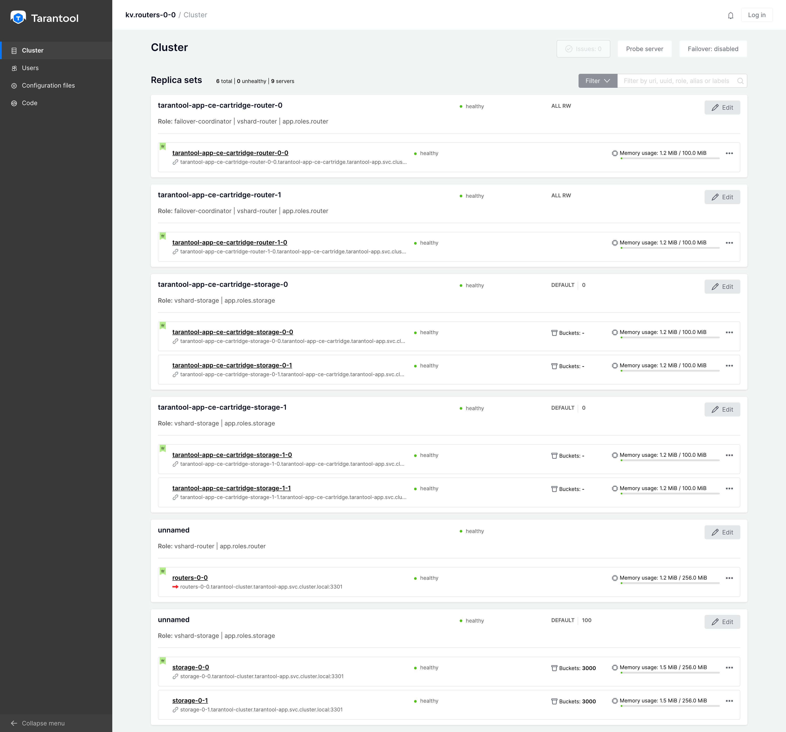

# Migration guide from version 0.0.* to version ≥1.0.0-rc1

## Disclaimer 

Where is no "kubernetes"-way to upgrade from ~0.0.* to ≥1.0.0-rc1.

Although this guide provides comprehensive information about the upgrade process, 
it will be useful for you to understand the basic concepts of [tarantool cartridge](https://github.com/tarantool/cartridge), [vshard](https://github.com/tarantool/vshard), [kubernetes](https://kubernetes.io/) and [helm](https://helm.sh/).

All applications built on the tarantool cartridge are unique. 

It is impossible to know the features of each of them.

Do not try to blindly follow the instructions, think about your every step and may the Force be with you.

## Terms

- `legacy operator` - Tarantool operator in version <1.0.0-rc1
- `new operator` - Tarantool operator in version ≥1.0.0-rc1

## Important

1. **Read whole guide before start**
2. Be careful with your actions.
3. There is no simple way to rollback
4. Make a whole backup and be ready to restore from it.
5. All cartridge application controlled by legacy operator in your kubernetes cluster MUST be migrated at the same time.
6. It can be helpful if you can change connection address in all application which communicating with your cartridge app.
7. Make sure you have enough resources in your kubernetes cluster 

## Migration process

1. Find out a namespace of your application
2. Find out a most stable instance<sup>*</sup> of your application in kubernetes pods and remember pod name

   ```shell
   kubectl -n tarantool-app get pod
   NAME          READY   STATUS    RESTARTS   AGE
   routers-0-0   1/1     Running   0          44h
   storage-0-0   1/1     Running   0          44h
   storage-0-1   1/1     Running   0          44h
   ```
   
   It seems good to choose vshard-router or any other instance without data.
   In this migration guide we will use `routers-0-0` pod.

   <sup>*</sup> most stable instance - in this context is an instance which usually choose to control your topology,
   it can be any instance, but we recommend to choose a vshard-router.  

3. Configure new helm chart for your application using pod name from previous step

   - Replace `tarantool/tarantool-operator-examples-kv` with your docker image name
   - Replace `0.0.7` with your docker image tag
   
   ```yaml
   tarantool:
     foreignLeader: "routers-0-0"  # The name of pod from step 2 - most important field
     bucketCount: 30000 # doesn't matter in migration flow
     auth:
       password: "secret-cluster-cookie" # you should use your actual cluster cookie here 
     image:
       repository: tarantool/tarantool-operator-examples-kv
       tag: 0.0.7
       pullPolicy: IfNotPresent
   roles: [...] # Your application roles here 
   ```
   
4. Add helm repository
   
   ```shell
   helm repo add tarantool https://tarantool.github.io/helm-charts/
   ```   

5. Make sure you are ready to update, at next step you going to lose a way to rollback
   - Make sure that all instances of your cartridge app is ready
   - Make sure that where are no issues in you cartridge cluster
   - Make sure that you have enough free resources in your kubernetes cluster
   
   Your topology should look like:

   

6. Manually delete legacy operator (**DO NOT USE HELM**)

   ```shell
   kubectl delete ns tarantool-operator
   ```
   
7. Install new operator using official helm-chart of new operator

   You can follow [installation guide](./installation.md) at this step

   ```shell
   helm upgrade --install tarantool-operator-ce tarantool/tarantool-operator \
   -n tarantool-operator-ce --create-namespace
   ```
   
   Custom resource definitions will not be updated by helm, you MUST update it manually:

   ```shell
   kubectl apply -f https://raw.githubusercontent.com/tarantool/helm-charts/master/charts/tarantool-operator/crds/apiextensions.k8s.io_v1_customresourcedefinition_cartridgeconfigs.tarantool.io.yaml
   kubectl apply -f https://raw.githubusercontent.com/tarantool/helm-charts/master/charts/tarantool-operator/crds/apiextensions.k8s.io_v1_customresourcedefinition_clusters.tarantool.io.yaml
   kubectl apply -f https://raw.githubusercontent.com/tarantool/helm-charts/master/charts/tarantool-operator/crds/apiextensions.k8s.io_v1_customresourcedefinition_roles.tarantool.io.yaml
   ```

8. Wait for new operator to be ready
       
   You can check it by calling next command:
   
   ```shell
   kubectl -n tarantool-operator-ce get deployments.apps
   # Operator is ready when its deployment is ready. 
   # Example NOT ready output
   # NAME                    READY   UP-TO-DATE   AVAILABLE   AGE
   # tarantool-operator-ce   0/1     1            0           10s
   # Example ready output
   # NAME                    READY   UP-TO-DATE   AVAILABLE   AGE
   # tarantool-operator-ce   1/1     1            1           108s
   ```
    
9. Install new cartridge helm chart using values file from step 3

   You can follow [deploy example application guide](./deploy-example-application.md) at this step

   - **Make sure that new helm release have DIFFERENT NAME from old app**
     Replace `you-app` with name which you wish in following command.
   - **Make sure that new helm release have SAME NAMESPACE as old app**
     Replace `your-namespace` with name of namespace where your app was deployed.
   - To prevent immediately re-balancing of vshard buckets is **strictly recommend** to set  
     zero weight for `vshard-storage` roles.
   
     You can do it by setting `tarantool.roles.*.vshard.weight` param in `values.yaml`
   - New cartridge app will be installed into you kubernetes cluster  
   - Replicasets of new app will join existing cartridge app immediately

   ```shell
   helm upgrade --install -n your-namespace you-app tarantool/cartridge --values ./values.yaml
   ```

10. Wait for all instances of deployed cartridge app to be ready
11. At this step you need to **connect to Cartridge UI on any new instance** using port-forwarding or any other method 
12. At this step in Cartridge UI you can see topology similar to following picture:
     
    
    As you can see there are new and old instances joins one cartridge cluster

13. Manually switch weights on old replicasets and new replicaset to migrate buckets:
    
    - Choose one of old replicasets
    - Remember its weight
    - Choose one of new replicasets
    - Set remembered weight on it 
    - Set zero weight on chosen old replicaset
    - Wait for to all buckets leaves old replicaset

    Buckets migration can produce lots of internal network traffic, do it step by step.
    It's **strictly recommended** to migrate 1 replicaset per time.  

14. You can continue when step 13 completed for all old replicasets
15. Disable and expel all old instance one by one
16. Manually delete all of old resource (DO NOT USE HELM)
    
    **Be careful with names, in this guide we are using names from legacy docs**

    ```shell
    kubectl -n tarantool-app delete clusters.tarantool.io -l tarantool-cluster
    kubectl -n tarantool-app delete roles.tarantool.io -l tarantool.io/cluster-id=tarantool-cluster
    kubectl -n tarantool-app delete sts -l tarantool.io/cluster-id=tarantool-cluster
    kubectl -n tarantool-app delete pod -l tarantool.io/cluster-id=tarantool-cluster
    kubectl -n tarantool-app delete svc tarantool-cluster
    kubectl -n tarantool-app delete svc routers
    kubectl -n tarantool-app delete svc storage
    kubectl -n tarantool-app delete secret sh.helm.release.v1.cartridge-app.v1
    ```

17. Repeat step 1-3 and 8-15 for each cartridge app in your kubernetes cluster    
18. Delete unused CRD

    ```shell
    kubectl delete crd replicasettemplates.tarantool.io
    ```

19. Done, now you are using new operator!
